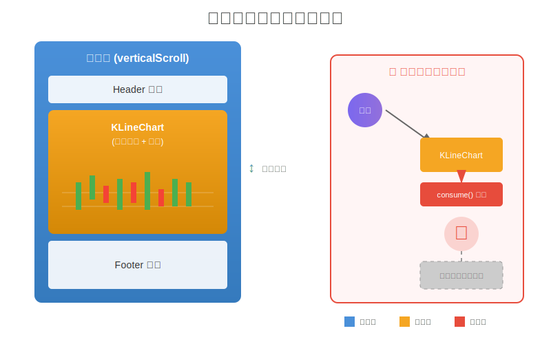
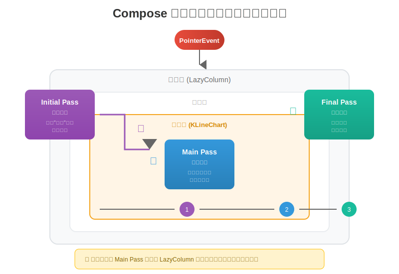
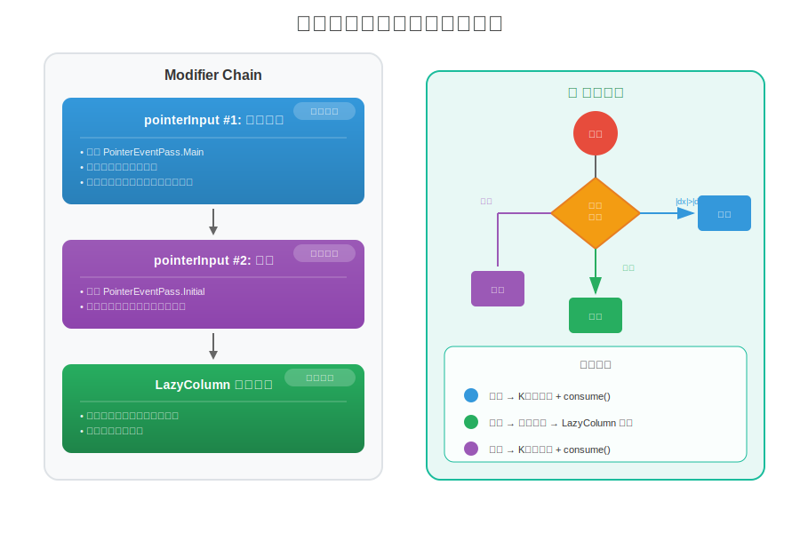
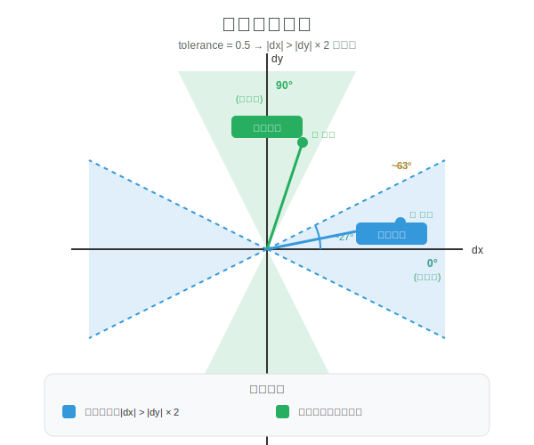
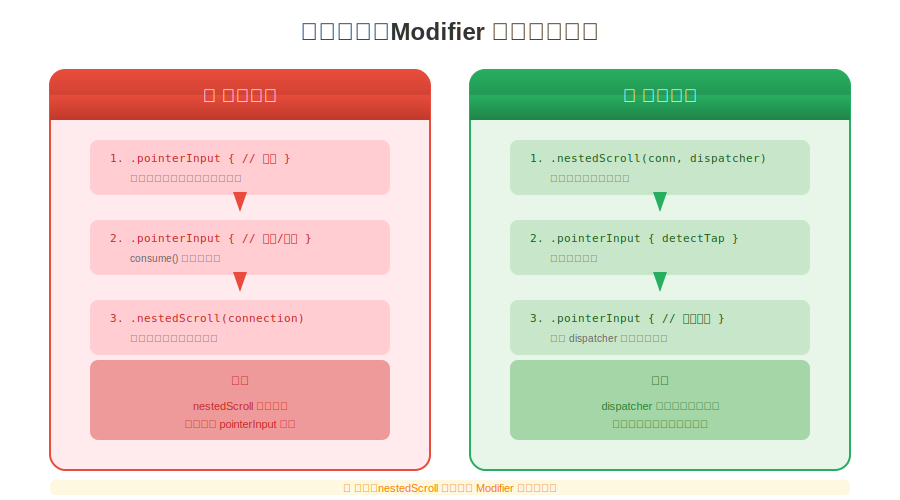
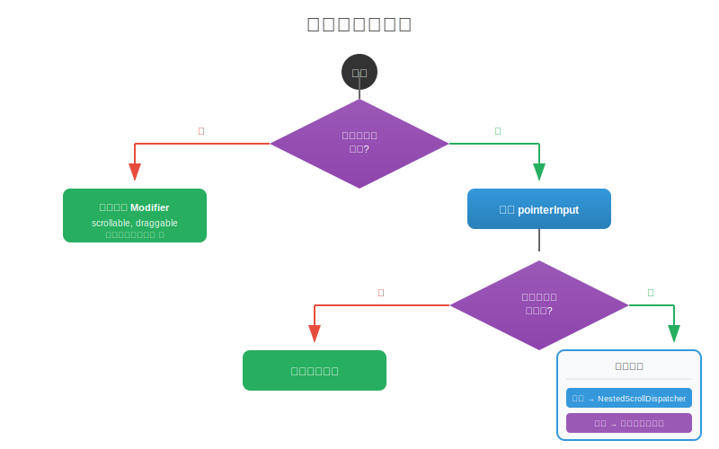

# Compose 嵌套滚动冲突完全指南

> 从零开始理解并解决 Compose 中的嵌套滚动冲突问题

---

## 📖 目录

1. [问题背景](#问题背景)
2. [问题是怎么导致的](#问题是怎么导致的)
3. [原理深度解析](#原理深度解析)
4. [解决方案](#解决方案)
   - [方案一：NestedScrollDispatcher（推荐用于简单场景）](#方案一nestedscrolldispatcher推荐用于简单场景)
   - [方案二：分离手势处理器（推荐用于复杂场景）](#方案二分离手势处理器推荐用于复杂场景)
5. [为什么某些方案不工作](#为什么某些方案不工作)
6. [最佳实践标准](#最佳实践标准)
7. [遇到类似问题的排查指南](#遇到类似问题的排查指南)

---

## 问题背景

### 场景描述

我们有一个 K 线图组件（KLineChart），它支持：
- **水平滑动**：浏览历史 K 线数据
- **双指缩放**：调整 K 线的时间粒度
- **长按**：显示十字光标查看详情

这个组件被嵌套在一个可垂直滚动的页面中：

```
┌─────────────────────────────────┐
│         SquareScreen            │
│    ┌─────────────────────┐      │
│    │   (可垂直滚动容器)    │ ↕    │
│    │  ┌───────────────┐  │      │
│    │  │   Header      │  │      │
│    │  ├───────────────┤  │      │
│    │  │               │  │      │
│    │  │  KLineChart   │ ↔ ← 水平滚动
│    │  │ (水平滚动+缩放) │  │      │
│    │  │               │  │      │
│    │  ├───────────────┤  │      │
│    │  │   Footer      │  │      │
│    │  └───────────────┘  │      │
│    └─────────────────────┘      │
└─────────────────────────────────┘
```

### 📊 问题场景图解



### 遇到的问题

1. **滚动失效**：在 K 线图上垂直滑动时，整个页面无法滚动
2. **缩放后更严重**：双指缩放 K 线后，垂直滚动完全失效
3. **十字光标误触发**：垂直滑动时容易意外触发十字光标

---

## 问题是怎么导致的

### 根本原因：手势事件被"吃掉"了

```
用户触摸屏幕
     │
     ▼
触摸事件生成
     │
     ▼
  谁先处理?
     │
     ├──→ KLineChart 的 pointerInput ──→ 事件被 consume() ──→ 父容器收不到事件! ──→ ❌ 页面无法滚动
     │
     └──→ 父容器的 verticalScroll ──→ 页面滚动 ✅
```

### 代码层面的问题

```kotlin
// ❌ 问题代码
.pointerInput(state.mode) {
    awaitEachGesture {
        val down = awaitFirstDown(requireUnconsumed = false)  // 捕获 down 事件
        // ...
        do {
            val event = awaitPointerEvent()
            // 即使是垂直滑动，事件也被这个循环持有
            // 父容器根本没机会处理！
        } while (event.changes.any { it.pressed })
    }
}
```

**关键点**：`awaitFirstDown(requireUnconsumed = false)` 会捕获触摸事件的 "down" 阶段。一旦被捕获，后续的 move 和 up 事件都会在这个 `awaitEachGesture` 块中处理，父容器无法接收完整的手势序列。

---

## 原理深度解析

### 📊 事件传递机制图解



### Compose 触摸事件传递机制

Compose 的指针事件传递分为三个阶段（Pass）：

```
                    PointerEvent
                         │
                         ▼
              ┌─────────────────────┐
              │   Initial Pass      │  ← 最早阶段，可以"偷看"事件
              │   (从外到内)         │
              └─────────────────────┘
                         │
                         ▼
              ┌─────────────────────┐
              │    Main Pass        │  ← 主要处理阶段
              │   (从内到外)         │
              └─────────────────────┘
                         │
                         ▼
              ┌─────────────────────┐
              │    Final Pass       │  ← 最终阶段
              │   (从外到内)         │
              └─────────────────────┘
```

### awaitEachGesture 的"持有"问题

**`awaitEachGesture` + `awaitFirstDown` 会"持有"整个手势序列**：

```
时间线：
────────────────────────────────────────────────────────────►

手指按下        手指移动        手指抬起
   │              │              │
   ▼              ▼              ▼
┌──────────────────────────────────┐
│     awaitEachGesture 持有期间      │
│                                  │
│  awaitFirstDown() 捕获 down 事件   │
│         │                        │
│         ▼                        │
│  此时 LazyColumn 无法获得控制权！   │
│                                  │
└──────────────────────────────────┘
```

即使我们在检测到垂直滑动后：
- 不消费事件 ❌ 无效
- 退出循环 ❌ 无效
- 重启 pointerInput ❌ 无效（手指还在屏幕上，新的 awaitFirstDown 会立即捕获）

**关键洞察**：一旦 `awaitFirstDown` 捕获了 down 事件，这个手势就"属于"我们了，无法中途转交给 LazyColumn。

### 嵌套滚动系统 (Nested Scroll System)

Compose 提供了专门的嵌套滚动协议来解决这类冲突：

```
┌─────────────────────────────────────────────────────────┐
│                    子组件                                │
│  ┌─────────────────────────────────────────────────┐   │
│  │              KLineChart                          │   │
│  │              NestedScrollDispatcher              │   │
│  └─────────────────────────────────────────────────┘   │
│                         │                               │
│         1. 检测到垂直滚动 │                               │
│                         ▼                               │
│         2. dispatchPreScroll()                          │
│                         │                               │
└─────────────────────────│───────────────────────────────┘
                          │
                          ▼
┌─────────────────────────────────────────────────────────┐
│                    父组件                                │
│  ┌─────────────────────────────────────────────────┐   │
│  │              verticalScroll                      │   │
│  │              NestedScrollConnection              │   │
│  └─────────────────────────────────────────────────┘   │
│                         │                               │
│         3. 父组件处理滚动 │                               │
│                         ▼                               │
│         4. 返回消费量                                    │
│                                                         │
└─────────────────────────────────────────────────────────┘
```

**核心概念：**

| 组件 | 作用 | 使用场景 |
|------|------|----------|
| `NestedScrollConnection` | 接收来自子组件的滚动事件 | 父组件实现 |
| `NestedScrollDispatcher` | 主动向父组件发送滚动事件 | 子组件使用 |

---

## 解决方案

根据场景复杂度，有两种推荐方案：

### 方案一：NestedScrollDispatcher（推荐用于简单场景）

适用于：方向检测后可以明确分发给父容器的场景。

```kotlin
val nestedScrollDispatcher = remember { NestedScrollDispatcher() }

modifier
    .nestedScroll(nestedScrollConnection, nestedScrollDispatcher)
    .pointerInput(state.mode) {
        awaitEachGesture {
            var lockedOrientation = 0  // 0=未定, 1=水平, 2=垂直
            val down = awaitFirstDown(requireUnconsumed = false)
            
            do {
                val event = awaitPointerEvent()
                val panDelta = event.calculatePan()
                
                // 方向检测
                if (lockedOrientation == 0) {
                    if (abs(panDelta.x) > touchSlop || abs(panDelta.y) > touchSlop) {
                        lockedOrientation = if (abs(panDelta.x) > abs(panDelta.y)) 1 else 2
                    }
                }
                
                when (lockedOrientation) {
                    1 -> {
                        // 水平模式：自己处理，消费事件
                        state.scroll(-panDelta.x / scrollUnit)
                        event.changes.forEach { it.consume() }
                    }
                    2 -> {
                        // 垂直模式：通过 Dispatcher 分发给父容器
                        val verticalDelta = Offset(0f, panDelta.y)
                        nestedScrollDispatcher.dispatchPreScroll(
                            available = verticalDelta,
                            source = NestedScrollSource.Drag
                        )
                        // 不消费事件！
                    }
                }
            } while (event.changes.any { it.pressed })
        }
    }
```

**局限性**：这个方案在某些复杂场景下可能失效，特别是：
- 连续缩放操作后
- 动态添加/移除子指标后
- 手势状态机复杂时

### 方案二：分离手势处理器（推荐用于复杂场景）

适用于：需要同时支持水平滚动、缩放、长按等多种手势的复杂组件。

### 📊 解决方案架构图



**核心思路**：将不同类型的手势分离到不同的 `pointerInput` 处理器：

```
┌─────────────────────────────────────────────────────────┐
│                    Modifier Chain                        │
│                                                         │
│  ┌─────────────────────────────────────────────────┐   │
│  │  pointerInput #1: 水平滚动                        │   │
│  │  - 使用自定义方向检测                              │   │
│  │  - 只有确定是水平时才消费事件                       │   │
│  │  - 垂直滑动时立即退出，不持有手势                   │   │
│  └─────────────────────────────────────────────────┘   │
│                         │                               │
│                         ▼                               │
│  ┌─────────────────────────────────────────────────┐   │
│  │  pointerInput #2: 缩放                           │   │
│  │  - 只处理多指手势                                 │   │
│  │  - 单指时不干预                                   │   │
│  └─────────────────────────────────────────────────┘   │
│                         │                               │
│                         ▼                               │
│  ┌─────────────────────────────────────────────────┐   │
│  │  LazyColumn 的滚动处理                            │   │
│  │  - 接收未被消费的垂直滚动事件                      │   │
│  └─────────────────────────────────────────────────┘   │
│                                                         │
└─────────────────────────────────────────────────────────┘
```

**实现代码**：

```kotlin
fun createGestureModifier(): Modifier {
    return Modifier
        // 1. 水平滚动 - 带角度容差的方向检测
        .pointerInput(Unit) {
            handleHorizontalScrollWithTolerance()
        }
        // 2. 缩放 - 只处理多指手势
        .pointerInput(Unit) {
            handleZoomGestures()
        }
}

/**
 * 水平滚动处理 - 关键实现
 */
private suspend fun PointerInputScope.handleHorizontalScrollWithTolerance() {
    val velocityTracker = VelocityTracker()
    
    awaitEachGesture {
        val down = awaitFirstDown(requireUnconsumed = false)
        velocityTracker.resetTracking()
        
        var totalDragX = 0f
        var totalDragY = 0f
        var isHorizontalLocked = false
        val touchSlop = viewConfiguration.touchSlop
        
        while (true) {
            // ⚠️ 关键：使用 Main pass，让其他处理器有机会先处理
            val event = awaitPointerEvent(PointerEventPass.Main)
            
            if (event.changes.all { !it.pressed }) {
                // 手指抬起，触发惯性滑动
                if (isHorizontalLocked) {
                    val velocity = velocityTracker.calculateVelocity()
                    flingController.startFling(velocity.x)
                }
                break
            }
            
            if (event.changes.any { it.isConsumed }) continue
            
            val change = event.changes.firstOrNull() ?: continue
            
            // 多指触摸时退出，让缩放处理器接管
            if (event.changes.size > 1) break
            
            velocityTracker.addPosition(change.uptimeMillis, change.position)
            
            val dragX = change.positionChange().x
            val dragY = change.positionChange().y
            
            if (!isHorizontalLocked) {
                totalDragX += dragX
                totalDragY += dragY
                
                if (abs(totalDragX) > touchSlop || abs(totalDragY) > touchSlop) {
                    // 角度容差：允许约 63 度的斜向滑动
                    if (abs(totalDragX) > abs(totalDragY) * 2) {
                        // ✅ 水平滑动 - 锁定并处理
                        isHorizontalLocked = true
                        applyScroll(totalDragX)
                        change.consume()
                    } else {
                        // ✅ 垂直滑动 - 立即退出！
                        // 关键：不消费任何事件，让 LazyColumn 处理
                        break
                    }
                }
            } else {
                applyScroll(dragX)
                change.consume()
            }
        }
    }
}

/**
 * 缩放处理 - 只处理多指
 */
private suspend fun PointerInputScope.handleZoomGestures() {
    awaitEachGesture {
        awaitFirstDown(requireUnconsumed = false)
        
        var isZooming = false
        
        while (true) {
            val event = awaitPointerEvent(PointerEventPass.Initial)
            
            if (event.changes.all { !it.pressed }) break
            
            val pointerCount = event.changes.count { it.pressed }
            
            // 只有多指时才处理
            if (pointerCount >= 2) {
                isZooming = true
                val zoom = event.calculateZoom()
                if (zoom != 1f) {
                    applyZoom(zoom)
                }
                event.changes.forEach { it.consume() }
            }
        }
    }
}
```

### 角度容差图解

为了提升用户体验，允许轻微斜向的滑动也被识别为水平滑动：

### 📊 角度容差可视化



```
                    90° (纯垂直)
                        │
                        │
            ╲           │           ╱
             ╲  垂直区域  │  垂直区域  ╱
              ╲         │         ╱
               ╲        │        ╱
                ╲       │       ╱
                 ╲      │      ╱    约 63°
    ──────────────╲─────┼─────╱──────────────  0° (纯水平)
                   ╲    │    ╱
                    ╲   │   ╱
                     ╲  │  ╱
                      ╲ │ ╱
                       ╲│╱
                        │
                        │
                    
    水平区域：|dx| > |dy| × 2  (tolerance = 0.5)
    垂直区域：其他
```

---

## 为什么某些方案不工作

### ❌ 方案 A：检测到垂直后不消费事件

```kotlin
if (isVertical) {
    // 不消费，期望 LazyColumn 处理
    continue
}
```

**失败原因**：`awaitEachGesture` 仍在运行，持有整个手势序列。事件虽然没被消费，但 LazyColumn 无法获得完整的手势序列（缺少 down 事件）。

### ❌ 方案 B：检测到垂直后退出循环

```kotlin
if (isVertical) {
    break // 退出循环
}
```

**失败原因**：退出后 `awaitEachGesture` 会等待手势结束，然后开始下一个周期。当前手势已经被"占用"，LazyColumn 仍然无法处理。

### ❌ 方案 C：重启 pointerInput

```kotlin
var restartKey by remember { mutableStateOf(0) }

.pointerInput(restartKey) {
    awaitEachGesture {
        if (isVertical) {
            restartKey++ // 触发 pointerInput 重启
            return@awaitEachGesture
        }
    }
}
```

**失败原因**：重启后新的 `awaitFirstDown` 会立即捕获当前已按下的手指。手指还在屏幕上，新的手势处理器会立即"接管"。

### ❌ 方案 D：使用 PointerEventPass.Initial

```kotlin
val event = awaitPointerEvent(PointerEventPass.Initial)
```

**失败原因**：Initial pass 会在 LazyColumn 之前拦截事件，即使不消费也会影响事件流。LazyColumn 的滚动检测依赖于完整的事件序列。

### ✅ 正确方案：分离 + Main Pass + 早期退出

```kotlin
// 使用 Main pass
val event = awaitPointerEvent(PointerEventPass.Main)

// 检测到垂直时立即退出，不做任何处理
if (isVertical) {
    break // 关键：在方向确定前就退出，不消费任何事件
}
```

**为什么有效**：
1. 使用 `Main` pass 而不是 `Initial`，不会阻断事件流
2. 在方向确定前退出，没有消费任何事件
3. LazyColumn 可以接收到完整的手势序列

---

## 最佳实践标准

### 📊 Modifier 链最佳实践



### 1. Modifier 链的正确顺序

```kotlin
Canvas(
    modifier = Modifier
        // 1️⃣ 首先：嵌套滚动连接（如果使用方案一）
        .nestedScroll(connection, dispatcher)
        
        // 2️⃣ 其次：简单手势（点击、长按）
        .pointerInput(key) { detectTapGestures { ... } }
        .pointerInput(key) { detectDragGesturesAfterLongPress { ... } }
        
        // 3️⃣ 最后：复杂手势（滚动、缩放）
        .pointerInput(key) { 
            awaitEachGesture { ... }
        }
)
```

### 2. 方向锁定状态机

```kotlin
// 方向锁定状态
var lockedOrientation = 0  // 0=未定, 1=水平, 2=垂直

// 方向检测（带角度容差）
if (lockedOrientation == 0) {
    accumulatedPan += panDelta
    
    val absDx = abs(accumulatedPan.x)
    val absDy = abs(accumulatedPan.y)
    
    if (absDx > touchSlop || absDy > touchSlop) {
        // tolerance = 0.5 意味着 |dx| > |dy| * 2 才算水平
        lockedOrientation = if (absDx > absDy * 2) {
            1  // 水平 → 自己处理
        } else {
            2  // 垂直 → 分发给父容器或退出
        }
    }
}
```

### 3. 事件消费原则

```
┌─────────────────────────────────────────────────────────┐
│                    事件消费决策树                        │
├─────────────────────────────────────────────────────────┤
│                                                         │
│   Q: 这个事件我需要处理吗？                              │
│                                                         │
│   ├── 是（水平滚动/缩放）                                │
│   │   └── consume() 并处理                              │
│   │                                                     │
│   └── 否（垂直滚动）                                     │
│       │                                                 │
│       ├── 方案一：使用 NestedScrollDispatcher 分发       │
│       │                                                 │
│       └── 方案二：立即退出 awaitEachGesture              │
│           （不消费任何事件，让 LazyColumn 自然处理）       │
│                                                         │
└─────────────────────────────────────────────────────────┘
```

### 4. 抬起手指的处理

```kotlin
fun onRelease() {
    // ✅ 总是清理状态
    if (mode == ChartMode.CROSSHAIR) {
        mode = ChartMode.SCROLLING
        crosshairIndex = -1
    }
    // 重置方向锁定
    lockedOrientation = 0
}
```

---

## 遇到类似问题的排查指南

### 🔍 诊断清单

```
□ 1. 确认问题现象
    - 哪个方向的滚动失效？
    - 什么操作后失效？（缩放？长按？）
    - 是完全失效还是偶发？

□ 2. 检查 Modifier 链
    - pointerInput 的顺序是否正确？
    - 是否使用了 nestedScroll？
    - key 参数是否会导致意外重建？

□ 3. 检查事件消费
    - 是否有不必要的 consume() 调用？
    - consume() 的条件是否正确？

□ 4. 检查手势检测器
    - awaitFirstDown 的 requireUnconsumed 参数？
    - 是否有多个手势检测器竞争？
    - 使用的是 Initial 还是 Main pass？
```

### 🛠️ 常见问题速查

| 症状 | 可能原因 | 解决方案 |
|------|----------|----------|
| 嵌套滚动完全失效 | pointerInput consume 所有事件 | 使用方案一或方案二 |
| 缩放后滚动失效 | 方向锁定未正确重置 | 分离缩放和滚动处理器 |
| 长按误触发 | 手势检测器顺序问题 | 调整 pointerInput 顺序 |
| 滚动不流畅 | 事件处理阻塞 | 优化方向检测逻辑 |
| 斜向滑动体验差 | 方向检测太严格 | 添加角度容差 |

### 📐 架构决策流程

### 📊 架构决策流程图



```
需要自定义手势?
    │
    ├── 否 → 使用内置 Modifier (scrollable, draggable) → 自动参与嵌套滚动 ✅
    │
    └── 是 → 使用 pointerInput
              │
              └── 会嵌套在滚动容器中?
                    │
                    ├── 否 → 直接处理事件
                    │
                    └── 是 → 选择方案：
                              │
                              ├── 简单场景 → 方案一：NestedScrollDispatcher
                              │
                              └── 复杂场景 → 方案二：分离手势处理器
```

---

## 💡 总结

### 核心要点

1. **理解事件流**：触摸事件从外到内传递，`consume()` 会阻止继续传递
2. **理解 awaitEachGesture**：一旦 `awaitFirstDown` 捕获事件，整个手势序列就被"持有"
3. **两种解决方案**：
   - 简单场景：`NestedScrollDispatcher` 主动分发
   - 复杂场景：分离手势处理器 + Main Pass + 早期退出
4. **方向锁定**：一旦确定滑动方向，就锁定并一致处理
5. **角度容差**：允许轻微斜向滑动，提升用户体验
6. **清理状态**：手指抬起时务必重置所有状态

### 方案对比

| 特性 | 方案一：NestedScrollDispatcher | 方案二：分离手势处理器 |
|------|-------------------------------|----------------------|
| 复杂度 | 较低 | 较高 |
| 适用场景 | 简单的方向分发 | 复杂的多手势组合 |
| 缩放后稳定性 | 可能有问题 | 稳定 |
| 代码侵入性 | 需要修改现有手势处理 | 重构手势架构 |
| 推荐度 | 先尝试 | 方案一失效时使用 |

### 关键代码模式

```kotlin
// 嵌套滚动组件的标准模板（方案二）
@Composable
fun NestedScrollableComponent(modifier: Modifier = Modifier) {
    Box(
        modifier = modifier
            // 水平滚动：使用 Main pass + 早期方向检测
            .pointerInput(Unit) {
                awaitEachGesture {
                    val down = awaitFirstDown(requireUnconsumed = false)
                    var orientation = 0
                    
                    while (true) {
                        val event = awaitPointerEvent(PointerEventPass.Main)
                        if (event.changes.all { !it.pressed }) break
                        
                        val delta = event.changes.first().positionChange()
                        
                        if (orientation == 0) {
                            if (abs(delta.x) > touchSlop || abs(delta.y) > touchSlop) {
                                if (abs(delta.x) > abs(delta.y) * 2) {
                                    orientation = 1  // 水平
                                } else {
                                    break  // 垂直 - 立即退出！
                                }
                            }
                        }
                        
                        if (orientation == 1) {
                            handleHorizontal(delta)
                            event.changes.forEach { it.consume() }
                        }
                    }
                }
            }
            // 缩放：只处理多指
            .pointerInput(Unit) {
                awaitEachGesture {
                    awaitFirstDown(requireUnconsumed = false)
                    while (true) {
                        val event = awaitPointerEvent(PointerEventPass.Initial)
                        if (event.changes.all { !it.pressed }) break
                        if (event.changes.count { it.pressed } >= 2) {
                            handleZoom(event.calculateZoom())
                            event.changes.forEach { it.consume() }
                        }
                    }
                }
            }
    )
}
```

---

> 📚 **延伸阅读**
> - [Compose 官方嵌套滚动文档](https://developer.android.com/develop/ui/compose/touch-input/pointer-input/scroll)
> - [PointerInput 深度解析](https://developer.android.com/develop/ui/compose/touch-input/pointer-input/understand-gestures)
