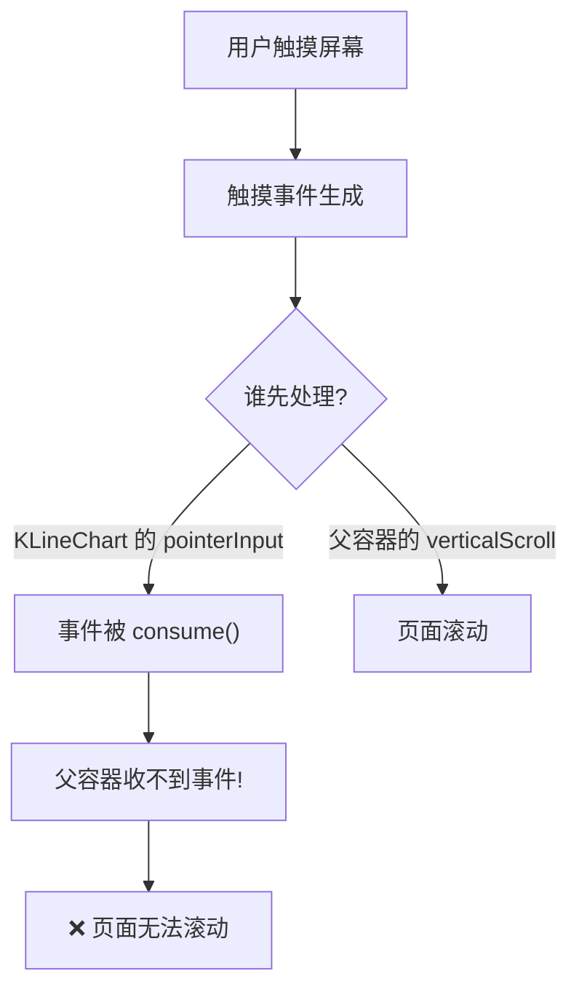
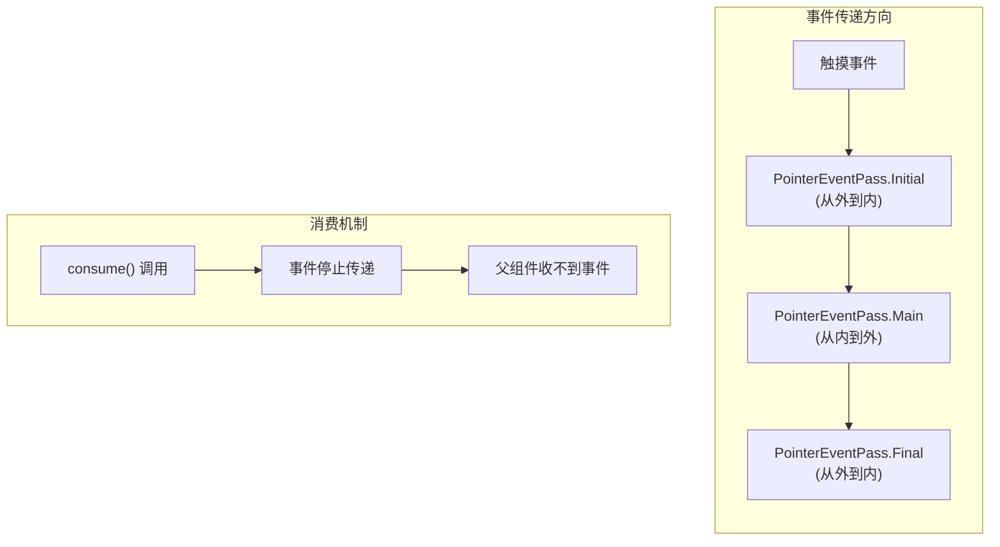
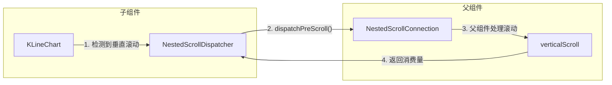
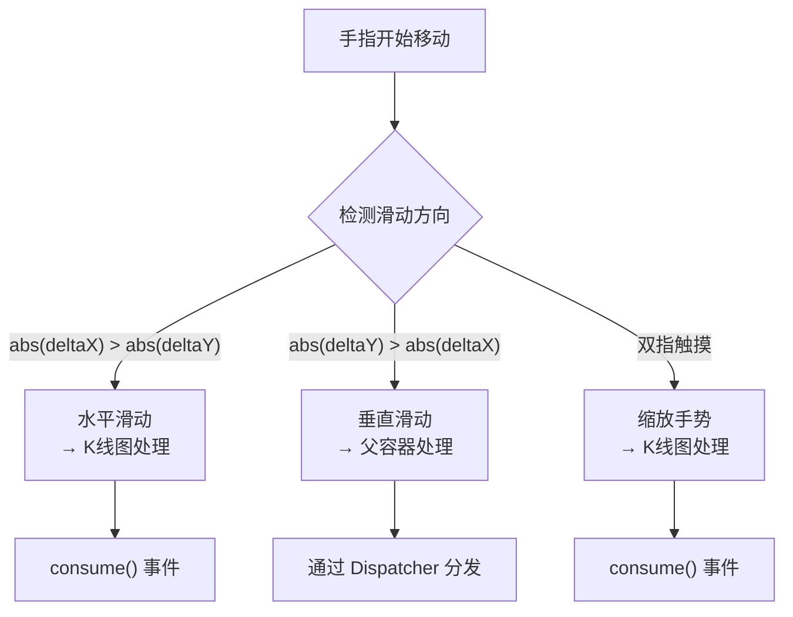
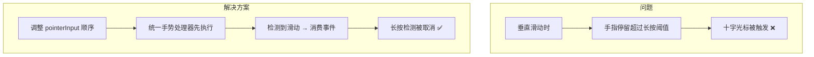
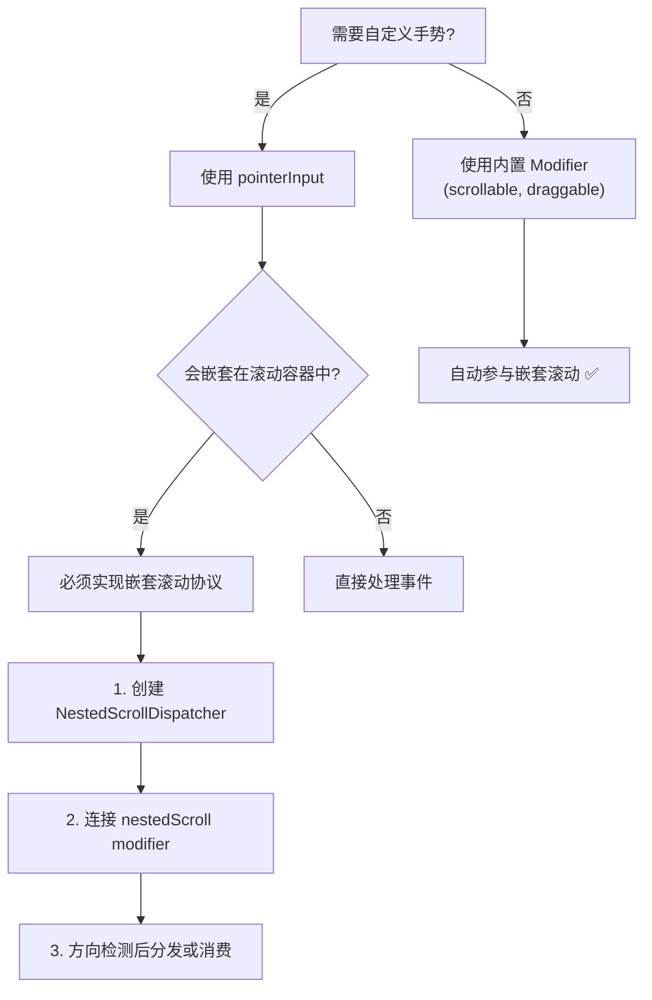

# Compose 嵌套滚动冲突完全指南

> 从零开始理解并解决 Compose 中的嵌套滚动冲突问题

---

## 📖 目录

1. [问题背景](#问题背景)
2. [问题是怎么导致的](#问题是怎么导致的)
3. [原理深度解析](#原理深度解析)
4. [解决思路](#解决思路)
5. [最佳实践标准](#最佳实践标准)
6. [遇到类似问题的排查指南](#遇到类似问题的排查指南)

---

## 问题背景

### 场景描述

我们有一个 K 线图组件（KLineChart），它支持：
- **水平滑动**：浏览历史 K 线数据
- **双指缩放**：调整 K 线的时间粒度
- **长按**：显示十字光标查看详情

这个组件被嵌套在一个可垂直滚动的页面中：

```
┌─────────────────────────────────┐
│         SquareScreen            │
│    ┌─────────────────────┐      │
│    │   (可垂直滚动容器)    │ ↕    │
│    │  ┌───────────────┐  │      │
│    │  │   Header      │  │      │
│    │  ├───────────────┤  │      │
│    │  │               │  │      │
│    │  │  KLineChart   │ ↔ ← 水平滚动 │
│    │  │ (水平滚动+缩放) │  │      │
│    │  │               │  │      │
│    │  ├───────────────┤  │      │
│    │  │   Footer      │  │      │
│    │  └───────────────┘  │      │
│    └─────────────────────┘      │
└─────────────────────────────────┘
```

### 遇到的问题

1. **滚动失效**：在 K 线图上垂直滑动时，整个页面无法滚动
2. **缩放后更严重**：双指缩放 K 线后，垂直滚动完全失效
3. **十字光标误触发**：垂直滑动时容易意外触发十字光标

### 📊 可视化图解


---

## 问题是怎么导致的

### 根本原因：手势事件被"吃掉"了



### 代码层面的问题

```kotlin
// ❌ 问题代码
.pointerInput(state.mode) {
    awaitEachGesture {
        val down = awaitFirstDown(requireUnconsumed = false)  // 捕获 down 事件
        // ...
        do {
            val event = awaitPointerEvent()
            // 即使是垂直滑动，事件也被这个循环持有
            // 父容器根本没机会处理！
        } while (event.changes.any { it.pressed })
    }
}
```

**关键点**：`awaitFirstDown(requireUnconsumed = false)` 会捕获触摸事件的 "down" 阶段。一旦被捕获，后续的 move 和 up 事件都会在这个 `awaitEachGesture` 块中处理，父容器无法接收完整的手势序列。

---

## 原理深度解析

### Compose 触摸事件传递机制



### 嵌套滚动系统 (Nested Scroll System)

Compose 提供了专门的嵌套滚动协议来解决这类冲突：

### 📊 事件传递三阶段图解




**核心概念：**

| 组件 | 作用 | 使用场景 |
|------|------|----------|
| `NestedScrollConnection` | 接收来自子组件的滚动事件 | 父组件实现 |
| `NestedScrollDispatcher` | 主动向父组件发送滚动事件 | 子组件使用 |

---

## 解决思路

### 第一步：理解方向锁定

当用户开始滑动时，我们需要判断滑动方向：



### 第二步：使用 NestedScrollDispatcher

```kotlin
// ✅ 正确方案
val nestedScrollDispatcher = remember { NestedScrollDispatcher() }

// 在 Modifier 链中连接
modifier
    .nestedScroll(nestedScrollConnection, nestedScrollDispatcher)
    .pointerInput(state.mode) {
        awaitEachGesture {
            // ...
            when (lockedOrientation) {
                1 -> {
                    // 水平模式：K线图处理，消费事件
                    state.scroll(-panDelta.x / scrollUnit)
                    changes.forEach { it.consume() }
                }
                2 -> {
                    // 垂直模式：通过 Dispatcher 分发给父容器
                    val verticalDelta = Offset(0f, panDelta.y)
                    
                    // 询问父容器是否要预先消费
                    val preConsumed = nestedScrollDispatcher.dispatchPreScroll(
                        available = verticalDelta,
                        source = NestedScrollSource.Drag
                    )
                    
                    // 剩余的给父容器后处理
                    nestedScrollDispatcher.dispatchPostScroll(
                        consumed = Offset.Zero,
                        available = verticalDelta - preConsumed,
                        source = NestedScrollSource.Drag
                    )
                    // 不消费事件！
                }
            }
        }
    }
```

### 📊 解决方案图解


### 第三步：处理长按手势冲突



---

## 最佳实践标准

### 1. Modifier 链的正确顺序

```kotlin
Canvas(
    modifier = Modifier
        // 1️⃣ 首先：嵌套滚动连接
        .nestedScroll(connection, dispatcher)
        
        // 2️⃣ 其次：简单手势（点击、长按）
        .pointerInput(key) { detectTapGestures { ... } }
        .pointerInput(key) { detectDragGesturesAfterLongPress { ... } }
        
        // 3️⃣ 最后：复杂手势（滚动、缩放）
        .pointerInput(key) { 
            awaitEachGesture { ... }
        }
)
```

### 📊 最佳实践图解


### 2. 方向锁定模式

```kotlin
// 方向锁定状态机
var lockedOrientation = 0  // 0=未定, 1=水平, 2=垂直

// 方向检测
if (lockedOrientation == 0) {
    accumulatedPan += panDelta
    
    if (abs(accumulatedPan.x) > touchSlop || abs(accumulatedPan.y) > touchSlop) {
        lockedOrientation = if (abs(accumulatedPan.x) > abs(accumulatedPan.y)) {
            1  // 水平 → 自己处理
        } else {
            2  // 垂直 → 分发给父容器
        }
    }
}
```

### 3. 事件消费原则

```
┌─────────────────────────────────────────────────────────┐
│                    事件消费决策树                        │
├─────────────────────────────────────────────────────────┤
│                                                         │
│   Q: 这个事件我需要处理吗？                              │
│                                                         │
│   ├── 是 → consume() 并处理                             │
│   │                                                     │
│   └── 否 → 两种选择：                                   │
│       │                                                 │
│       ├── 简单场景：不调用 consume()，让事件继续传递      │
│       │                                                 │
│       └── 复杂场景：使用 NestedScrollDispatcher        │
│           主动分发给父容器                               │
│                                                         │
└─────────────────────────────────────────────────────────┘
```

### 4. 抬起手指的处理

```kotlin
fun onRelease() {
    // ✅ 总是清理状态
    if (mode == ChartMode.CROSSHAIR) {
        mode = ChartMode.SCROLLING
        crosshairIndex = -1
    }
}
```

---

## 遇到类似问题的排查指南

### 🔍 诊断清单

```
□ 1. 确认问题现象
    - 哪个方向的滚动失效？
    - 什么操作后失效？（缩放？长按？）
    - 是完全失效还是偶发？

□ 2. 检查 Modifier 链
    - pointerInput 的顺序是否正确？
    - 是否使用了 nestedScroll？
    - key 参数是否会导致意外重建？

□ 3. 检查事件消费
    - 是否有不必要的 consume() 调用？
    - consume() 的条件是否正确？

□ 4. 检查手势检测器
    - awaitFirstDown 的 requireUnconsumed 参数？
    - 是否有多个手势检测器竞争？
```

### 🛠️ 常见问题速查

| 症状 | 可能原因 | 解决方案 |
|------|----------|----------|
| 嵌套滚动完全失效 | pointerInput consume 所有事件 | 使用 NestedScrollDispatcher |
| 缩放后滚动失效 | 方向锁定未正确重置 | 每次 awaitEachGesture 重置状态 |
| 长按误触发 | 手势检测器顺序问题 | 调整 pointerInput 顺序 |
| 滚动不流畅 | 事件处理阻塞 | 优化方向检测逻辑 |

### 📐 架构决策流程



---

## 💡 总结

### 核心要点

1. **理解事件流**：触摸事件从外到内传递，consume() 会阻止继续传递
2. **善用嵌套滚动**：`NestedScrollDispatcher` 是解决冲突的正确工具
3. **方向锁定**：一旦确定滑动方向，就锁定并一致处理
4. **清理状态**：手指抬起时务必重置所有状态
5. **Modifier 顺序**：nestedScroll 在前，复杂手势在后

### 关键代码模式

```kotlin
// 嵌套滚动组件的标准模板
@Composable
fun NestedScrollableComponent(modifier: Modifier = Modifier) {
    val dispatcher = remember { NestedScrollDispatcher() }
    val connection = remember { object : NestedScrollConnection { ... } }
    
    Box(
        modifier = modifier
            .nestedScroll(connection, dispatcher)
            .pointerInput(Unit) {
                awaitEachGesture {
                    var orientation = 0
                    val down = awaitFirstDown()
                    
                    do {
                        val event = awaitPointerEvent()
                        val delta = event.calculatePan()
                        
                        // 方向检测
                        if (orientation == 0 && delta.getDistance() > touchSlop) {
                            orientation = if (abs(delta.x) > abs(delta.y)) 1 else 2
                        }
                        
                        when (orientation) {
                            1 -> handleHorizontal(delta, event.changes)
                            2 -> dispatchToParent(dispatcher, delta)
                        }
                    } while (event.changes.any { it.pressed })
                }
            }
    )
}
```

---

> 📚 **延伸阅读**
> - [Compose 官方嵌套滚动文档](https://developer.android.com/develop/ui/compose/touch-input/pointer-input/scroll)
> - [PointerInput 深度解析](https://developer.android.com/develop/ui/compose/touch-input/pointer-input/understand-gestures)
